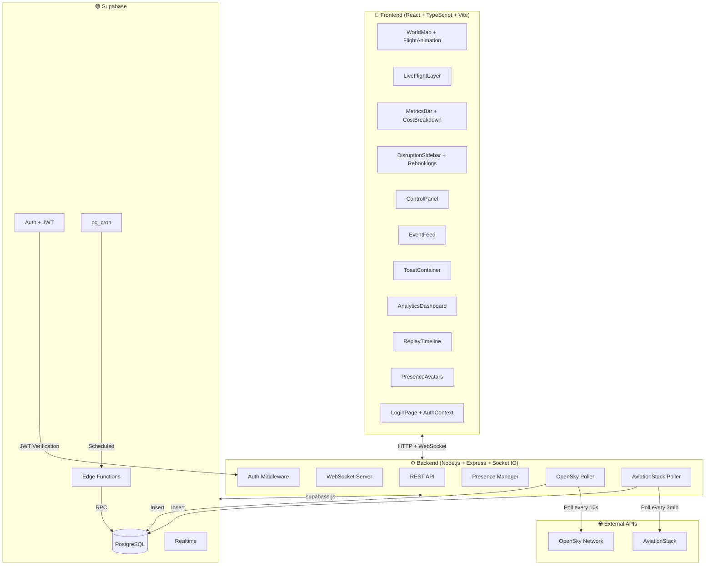
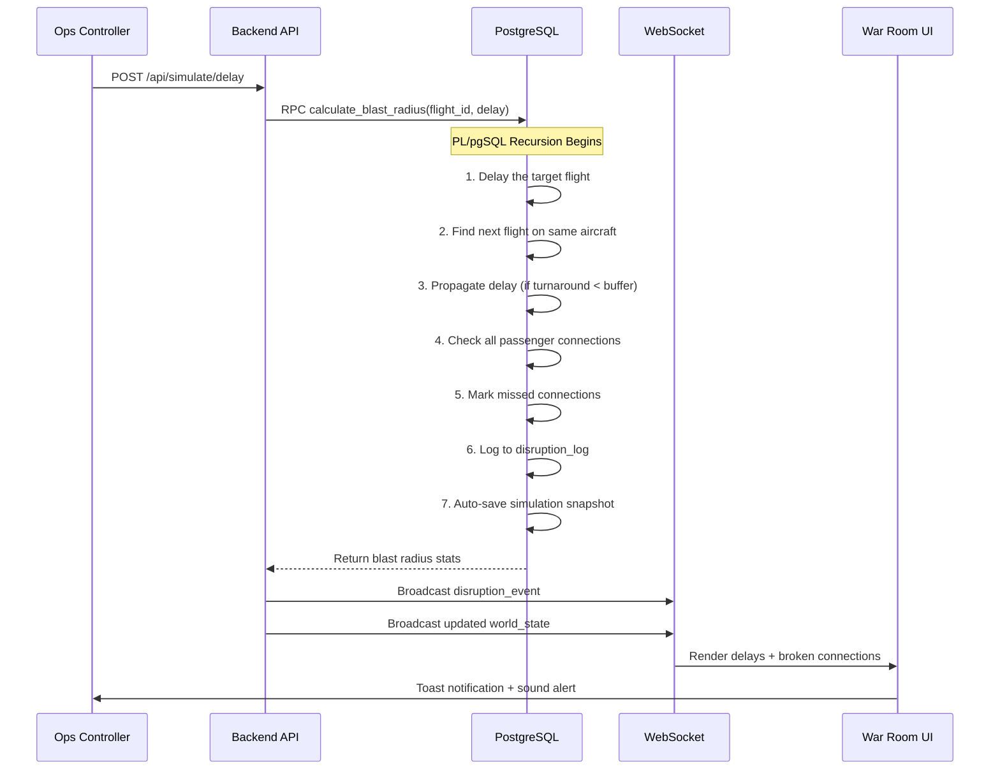
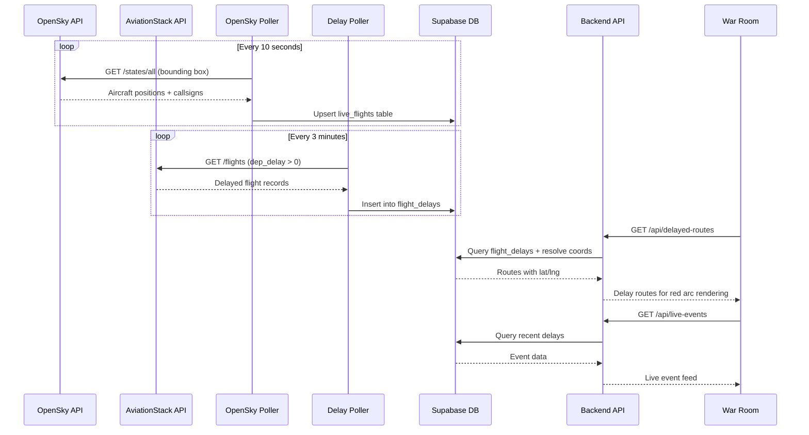
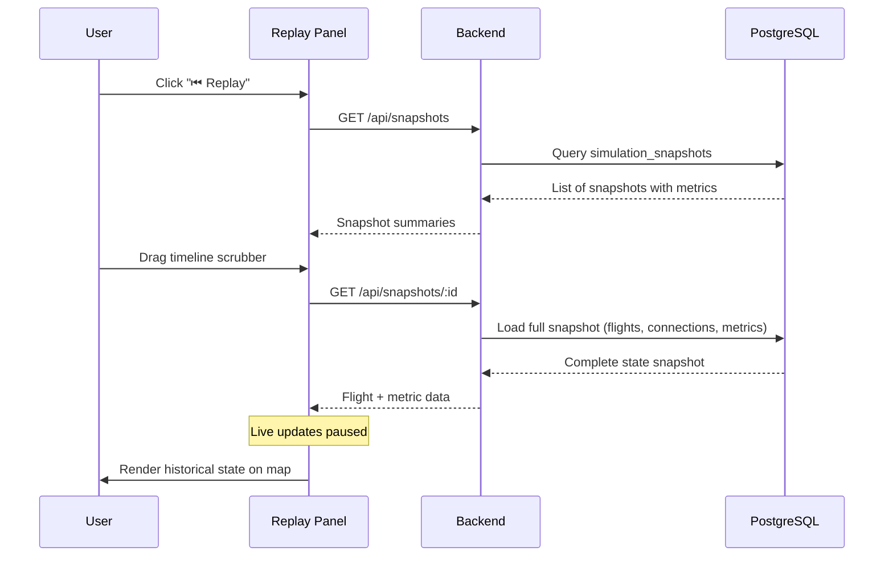
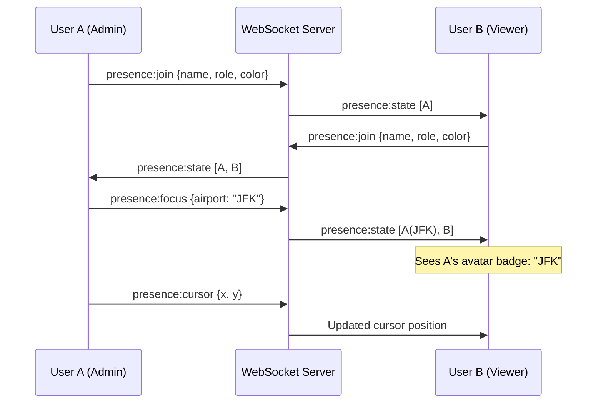
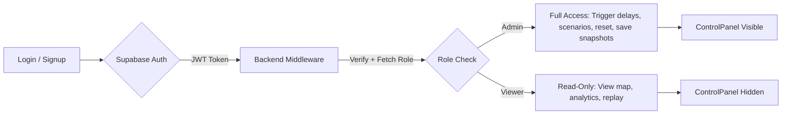
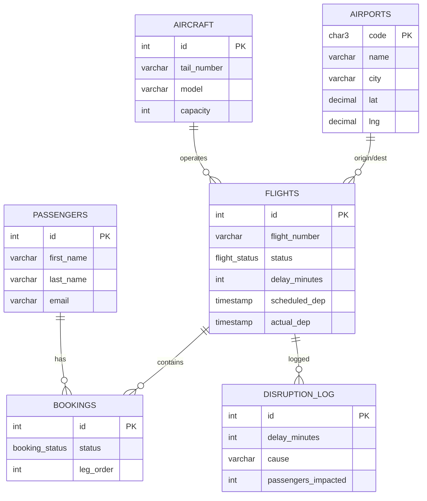

# ✈️ Global Flight Disruption Engine

<div align="center">

**Real-Time War Room for Simulating & Visualizing Cascading Flight Delays Across a Global Airline Network**

[](https://reactjs.org/)
[](https://nodejs.org/)
[-3ECF8E?logo=supabase)](https://supabase.com/)
[](https://socket.io/)
[](https://leafletjs.com/)
[](https://opensky-network.org/)
[](https://deno.com/)
[](LICENSE)

</div>

---

## 🚀 Overview

The **Global Flight Disruption Engine** is a full-stack, ops-grade dashboard that models how a single flight delay can cascade into a network-wide crisis — stranding passengers, breaking connections, and costing airlines millions. Think of it as a **flight operations war room** where you can:

- **Simulate Mode** — Trigger chaos scenarios and watch disruptions ripple in real-time
- **Live Mode** — Connect to real-world flight data via OpenSky Network and AviationStack APIs, see actual delays, and visualize live aircraft positions on a global map

The platform demonstrates advanced Supabase integration (Auth, Realtime, Edge Functions, RLS, pg_cron), complex PL/pgSQL logic, real-time multi-user collaboration, live API data ingestion, and production-level React architecture.

### 🌟 Key Features

- **🗺️ Live World Map** — Animated planes on great-circle routes with bearing rotation, heatmap airports, and delay route arcs
- **🔴 Dual Mode** — Switch between simulation mode and live mode with real-world flight data
- **✈️ OpenSky Integration** — Real-time aircraft positions from the OpenSky Network API with live plane markers
- **⏱️ AviationStack Delays** — Live flight delay data ingested every 3 minutes from AviationStack API
- **⚡ Chaos Simulation** — Trigger random delays, named disaster scenarios (snowstorms, volcanic ash), or autonomous pg_cron chaos
- **🔄 Blast Radius Engine** — PL/pgSQL recursively propagates delays through aircraft rotations and detects missed connections
- **📊 Analytics Dashboard** — 5 interactive Recharts panels: disruption frequency, cost trends, airport rankings, cascade analysis, delay timeline
- **📼 Historical Replay** — Store snapshots and scrub through past cascades with a timeline slider
- **👥 Multi-User War Room** — Real-time presence: see who's online, their cursor position, and which airport they're viewing
- **🔐 Auth + RBAC** — Supabase Auth with admin/viewer roles
- **🔔 Smart Notifications** — Compact toast alerts with auto-dismissal and Web Audio sound effects
- **💰 Cost Impact Engine** — Real-time financial modeling: hotel vouchers, rebooking fees, crew overtime
- **🎫 Rebooking Suggestions** — Automated alternative flight suggestions for stranded passengers

---

## 🏗️ Architecture



### Core Components

| Layer | Technology | Purpose |
|-------|-----------|---------|
| **Frontend** | React 19, TypeScript, Vite, Leaflet, Recharts | War room dashboard, analytics, presence UI |
| **Backend** | Node.js, Express, Socket.IO | API bridge, WebSocket hub, auth middleware |
| **Database** | PostgreSQL (Supabase) | Flight network, PL/pgSQL blast radius engine |
| **Auth** | Supabase Auth + JWT | Login, signup, role-based access control |
| **Serverless** | Supabase Edge Functions (Deno) | Autonomous chaos simulation |
| **Scheduling** | pg_cron | Server-side periodic flight updates + chaos |
| **Realtime** | Socket.IO + Supabase Realtime | Live state updates, multi-user presence |
| **Live Data** | OpenSky Network + AviationStack | Real aircraft positions + flight delay data |

---

## 📂 Project Structure

```
flightsim/
├── database/
│   ├── schema.sql                # Core tables: airports, aircraft, flights, passengers, bookings
│   ├── flight_status_schema.sql  # Live tables: flight_delays, live_bookings
│   ├── procedures.sql            # PL/pgSQL: blast radius engine, rebookings, cost estimation
│   ├── seed_data.sql             # 15 airports, 10 aircraft, 50+ flights, 200+ passengers
│   ├── schema_extensions.sql     # Snapshots, user profiles, RLS policies, triggers
│   └── pg_cron_setup.sql         # Autonomous scheduling (chaos every 60s)
│
├── backend/
│   └── src/
│       ├── index.js              # API server: auth, simulation, analytics, live endpoints, presence
│       ├── db.js                 # Supabase client initialization
│       ├── opensky.js            # OpenSky Network poller — live aircraft positions
│       ├── aviationstack.js      # AviationStack poller — real flight delay data
│       └── generate_passengers.js # Synthetic passenger generation for live flights
│
├── frontend/
│   └── src/
│       ├── components/
│       │   ├── WorldMap.tsx             # Leaflet map with heatmap airports + delay route arcs
│       │   ├── FlightAnimation.tsx      # Animated plane markers with bearing + trails
│       │   ├── LiveFlightLayer.tsx       # Real-time OpenSky aircraft markers
│       │   ├── MetricsBar.tsx           # Live metrics + cost breakdown popup
│       │   ├── DisruptionSidebar.tsx     # Delayed flights, missed connections, rebookings
│       │   ├── ControlPanel.tsx         # Chaos triggers (random delay, scenarios, reset)
│       │   ├── EventFeed.tsx            # Scrolling event log (sim & live modes)
│       │   ├── AirportPopup.tsx         # Detailed airport view (departures, arrivals)
│       │   ├── ToastContainer.tsx       # Minimalistic toast notifications
│       │   ├── AnalyticsDashboard.tsx   # 5-panel Recharts analytics (sim & live)
│       │   ├── ReplayTimeline.tsx       # Historical snapshot scrubber
│       │   ├── PresenceAvatars.tsx      # Multi-user presence indicators
│       │   └── LoginPage.tsx            # Auth UI (login/signup)
│       ├── contexts/
│       │   └── AuthContext.tsx           # JWT persistence, session management, RBAC
│       ├── hooks/
│       │   └── useFlightData.ts         # WebSocket + REST data layer with auth + presence
│       └── types/
│           └── index.ts                 # 25+ TypeScript interfaces
│
├── supabase/
│   └── functions/
│       └── chaos-simulator/
│           └── index.ts                 # Deno Edge Function for serverless chaos
│
└── guides/
    └── connecting_to_real_time_data.md  # Setup guide for live API integrations
```

---

## 🎯 Core Workflows

### 1. ⚡ Delay Propagation (Blast Radius Engine)



### 2. 🔴 Live Data Ingestion Pipeline



### 3. 🌪️ Chaos Scenarios

| Scenario | Description | Impact |
|----------|-------------|--------|
| ❄️ **Snowstorm JFK** | Heavy snow grounds flights at JFK | 2-5 flights delayed 60-180min |
| 🌋 **Volcanic Ash Cloud** | Ash plume disrupts European airspace | 3-6 flights affected across EU |
| 🔧 **Maintenance Emergency** | Unscheduled maintenance at major hub | 1-3 aircraft grounded |
| 🌊 **Typhoon Pacific** | Typhoon disrupts Asia-Pacific routes | 2-4 trans-Pacific delays |
| 🎲 **Random Delay** | Random flight gets 15-180min delay | Cascading based on network position |
| 🤖 **Autonomous (pg_cron)** | Server-side chaos every 60 seconds | Continuous disruption simulation |

### 4. 📼 Historical Replay Flow



### 5. 👥 Multi-User Presence



### 6. 🔐 Auth + Role-Based Access



---

## 🎨 Technology Stack

### 🔗 Backend & Database
| Technology | Purpose |
|-----------|---------|
| **Supabase (PostgreSQL)** | Primary database with RLS, triggers, and RPC |
| **PL/pgSQL** | Blast radius engine — recursive delay propagation |
| **pg_cron** | Server-side scheduling for autonomous simulation |
| **Supabase Auth** | JWT-based authentication with user profiles |
| **Supabase Edge Functions** | Serverless chaos simulation (Deno runtime) |
| **Node.js + Express** | API server and auth middleware |
| **Socket.IO** | Real-time WebSocket updates and presence |

### ✈️ Live Data Sources
| Technology | Purpose |
|-----------|---------|
| **OpenSky Network API** | Real-time aircraft positions (latitude, longitude, altitude, velocity) |
| **AviationStack API** | Live flight delay data (departure/arrival delays, airline info) |

### 🎨 Frontend
| Technology | Purpose |
|-----------|---------|
| **React 19 + TypeScript** | Component architecture with full type safety |
| **Vite** | Lightning-fast dev server and build tool |
| **Leaflet + react-leaflet** | Interactive world map with custom markers |
| **Recharts** | Analytics charts (bar, line, area, pie) |
| **Web Audio API** | Alert sound effects for notifications |
| **CSS Variables** | Dark-themed design system with glassmorphism |

---

## 🚀 Quick Start

### Prerequisites

- **Node.js 18+** and npm
- A [Supabase](https://supabase.com) project (free tier works)
- Git
- (Optional) [OpenSky Network](https://opensky-network.org/) account for live aircraft data
- (Optional) [AviationStack](https://aviationstack.com/) API key for live delay data

### Installation

1. **Clone the repository**
   ```bash
   git clone https://github.com/yourusername/flightsim.git
   cd flightsim
   ```

2. **Database Setup** (Supabase SQL Editor)

   Run these SQL files **in order** in your Supabase project's SQL Editor:

   ```
   1. database/schema.sql               — Core tables + ENUMs
   2. database/flight_status_schema.sql  — Live data tables (flight_delays, live_bookings)
   3. database/procedures.sql            — PL/pgSQL functions (blast radius engine)
   4. database/seed_data.sql             — Airports, aircraft, flights, passengers
   5. database/schema_extensions.sql     — Snapshots, user profiles, RLS, triggers
   6. database/pg_cron_setup.sql         — (Optional) Autonomous scheduling
   ```

3. **Backend Setup**
   ```bash
   cd backend
   npm install
   ```

   Create a `.env` file:
   ```env
   SUPABASE_URL=https://your-project.supabase.co
   SUPABASE_SERVICE_KEY=your-service-role-key
   PORT=3001

   # Optional — for live mode
   OPENSKY_USERNAME=your-opensky-username
   OPENSKY_PASSWORD=your-opensky-password
   AVIATIONSTACK_API_KEY=your-aviationstack-key
   ```

   Start the servers:
   ```bash
   # Core API server
   npm run dev

   # (Optional) Live data pollers
   npm run opensky    # Real-time aircraft positions
   npm run delays     # Flight delay ingestion
   ```

4. **Frontend Setup**
   ```bash
   cd frontend
   npm install
   npm run dev
   ```

5. **Open the War Room**

   Navigate to **http://localhost:5173** — sign up, then toggle between Sim and Live modes!

### Optional: Deploy Edge Function
```bash
supabase functions deploy chaos-simulator
```

---

## 📋 API Reference

### Auth Endpoints
| Method | Endpoint | Description | Auth |
|--------|----------|-------------|------|
| `POST` | `/api/auth/signup` | Create account | — |
| `POST` | `/api/auth/login` | Sign in, returns JWT | — |
| `GET` | `/api/auth/me` | Get current user + role | Bearer |

### Simulation Endpoints
| Method | Endpoint | Description | Auth |
|--------|----------|-------------|------|
| `POST` | `/api/simulate/delay` | Trigger a flight delay | Admin |
| `POST` | `/api/simulate/scenario` | Run a named scenario | Admin |
| `POST` | `/api/simulate/reset` | Reset all simulation state | Admin |
| `POST` | `/api/edge/chaos` | Invoke Edge Function chaos | Admin |

### Data Endpoints
| Method | Endpoint | Description | Auth |
|--------|----------|-------------|------|
| `GET` | `/api/state` | Full initial state (airports, flights, aircraft) | Bearer |
| `GET` | `/api/airports/:code` | Detailed airport view | Bearer |
| `GET` | `/api/rebookings` | Suggested rebookings for stranded pax | Bearer |
| `GET` | `/api/cost-estimate` | Financial impact breakdown | Bearer |
| `GET` | `/api/analytics` | Disruption log + airport aggregations | Bearer |
| `GET` | `/api/snapshots` | List historical snapshots | Bearer |
| `GET` | `/api/snapshots/:id` | Load full snapshot | Bearer |

### Live Mode Endpoints
| Method | Endpoint | Description | Auth |
|--------|----------|-------------|------|
| `GET` | `/api/live-metrics` | Real-time delay counts, passenger impact, costs | — |
| `GET` | `/api/live-events` | Recent delay events for live event feed | — |
| `GET` | `/api/live-analytics` | Aggregated analytics from live delay data | — |
| `GET` | `/api/delayed-routes` | Delay routes with coordinates for map arcs | — |
| `GET` | `/api/delayed-flights` | Delayed flights with passenger impact data | — |
| `GET` | `/api/opensky/states` | Live aircraft positions from OpenSky | — |

### WebSocket Events
| Event | Direction | Payload |
|-------|-----------|---------|
| `world_state` | Server → Client | Full flight state + metrics |
| `disruption_event` | Server → Client | Individual delay/cascade event |
| `simulation_reset` | Server → Client | Signal to reset UI |
| `presence:join` | Client → Server | `{userId, displayName, role}` |
| `presence:cursor` | Client → Server | `{x, y}` |
| `presence:focus` | Client → Server | `{airport: "JFK"}` |
| `presence:state` | Server → Client | Array of all connected users |

---

## 🗄️ Database Schema

### Core Tables



### Live Data Tables

| Table | Purpose |
|-------|---------|
| `flight_delays` | Real-time delay records from AviationStack (airline, airports, delay minutes) |
| `live_bookings` | Synthetic passenger data generated for delayed live flights |
| `simulation_snapshots` | JSONB snapshots of full simulation state for replay |
| `user_profiles` | User roles (admin/viewer), display names, linked to Supabase Auth |

### Key PL/pgSQL Functions

| Function | Description |
|----------|-------------|
| `calculate_blast_radius(flight_id, delay, cause)` | Recursively propagates delays through aircraft rotations, detects missed connections |
| `trigger_random_delay()` | Picks a random active flight and delays it |
| `update_flight_statuses()` | Advances flight lifecycle based on timestamps |
| `suggest_rebookings()` | Finds alternative flights for stranded passengers |
| `save_simulation_snapshot(label)` | Captures full state to `simulation_snapshots` |
| `reset_simulation()` | Resets all flights, bookings, and disruption logs |

---

## 🔒 Security

| Feature | Implementation |
|---------|---------------|
| **Authentication** | Supabase Auth with email/password, JWT tokens |
| **Authorization** | Role-based middleware: `authMiddleware` + `requireAdmin` |
| **Row Level Security** | RLS policies on `simulation_snapshots` and `user_profiles` |
| **API Protection** | Admin-only endpoints (delay, scenario, reset, save) |
| **Session Management** | JWT stored in `localStorage`, auto-restore on reload |

---

## 📊 Key PostgreSQL Features Demonstrated

| Feature | Usage |
|---------|-------|
| **PL/pgSQL Functions** | Recursive delay propagation engine |
| **FOR..IN..LOOP** | Iterating passenger bookings to detect missed connections |
| **Custom ENUMs** | `flight_status`, `booking_status` for type-safe statuses |
| **Recursive Logic** | Aircraft chain delays (A→B→C) via depth-limited recursion |
| **JSONB Columns** | Simulation snapshots storing full flight state |
| **RLS Policies** | Fine-grained row-level access control |
| **Triggers** | Auto-create user profile on Supabase Auth signup |
| **pg_cron** | Server-side scheduled tasks (chaos + flight updates) |
| **Edge Functions** | Serverless Deno functions invoked via HTTP |
| **RPC Calls** | `supabase.rpc()` for executing server-side logic |
| **Foreign Key Relations** | Supabase nested selects with relation joins |

---

## 🛠️ Environment Variables

### Backend (`backend/.env`)

```env
# Required
SUPABASE_URL=https://your-project.supabase.co
SUPABASE_SERVICE_KEY=eyJ...your-service-role-key
PORT=3001

# Optional — Live Mode
OPENSKY_USERNAME=your-opensky-username
OPENSKY_PASSWORD=your-opensky-password
AVIATIONSTACK_API_KEY=your-aviationstack-api-key
```

### Supabase Edge Functions

```env
SUPABASE_URL=https://your-project.supabase.co
SUPABASE_SERVICE_ROLE_KEY=eyJ...your-service-role-key
```

---

## 📈 Performance

| Metric | Value |
|--------|-------|
| **Frontend Build** | ~2s (Vite) |
| **TypeScript** | 0 errors, strict mode |
| **Bundle Size (gzipped)** | ~260KB total |
| **Components** | 14 React components |
| **Source Lines** | ~6,000+ lines |
| **WebSocket Latency** | Real-time (2s polling interval) |
| **OpenSky Polling** | Every 10 seconds |
| **Delay Ingestion** | Every 3 minutes |
| **Airport Coord Database** | 200+ worldwide IATA airports |

---

## 🙏 Acknowledgments

- **[Supabase](https://supabase.com)** — Database, Auth, Realtime, Edge Functions, and pg_cron
- **[Leaflet](https://leafletjs.com)** — Interactive map rendering
- **[Recharts](https://recharts.org)** — Chart components for analytics
- **[Socket.IO](https://socket.io)** — Real-time WebSocket communication
- **[OpenSky Network](https://opensky-network.org)** — Real-time aircraft position data
- **[AviationStack](https://aviationstack.com)** — Live flight delay data
- **[Esri](https://www.esri.com)** — Dark gray map tiles with English labels

---

<div align="center">

**✈️ Simulating Network Chaos · Visualizing Real-World Delays · Building Resilience**

Built with ☕ and Supabase

</div>
